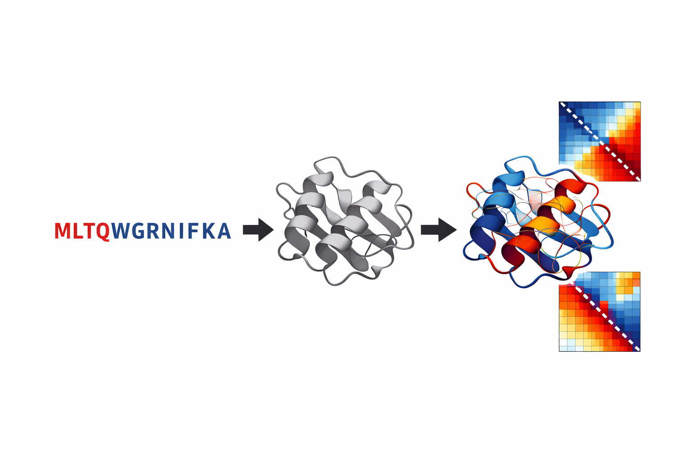

<div align="center">
  
  <br/><br/>

  # 🧬 Protein Attention Explainer

  **Visualize how ESMFold builds a 3D structure from sequence via its attention maps**

  
  
  
  
  
  

</div>

Attention maps from ESM-2 (33 layers × 20 heads) projected onto the predicted 3D structure in Mol*.

```
sequence -> ESMFold -> PDB + attention [L, H, N, N] -> 3D viewer with attention overlay
```

## Features

- **Structure prediction** — ESMFold (facebook/esmfold_v1) via HuggingFace
- **Attention extraction** — hooks on all ESM-2 encoder layers, no model modification
- **APC correction** — Average Product Correction removes phylogenetic background
- **3D visualization** — **Mol*** (Molstar) with:
  - Cartoon colored by attention intensity via B-factor / `uncertainty` color theme
  - Dynamic attention edge overlay (2D canvas projected through Mol* camera matrices)
  - Click residue -> focus + see all its attention connections
- **Interactive controls** — layer slider, threshold, animation, color modes
- **Heatmap** — per-layer N×N attention matrix
- **Layer profile** — entropy bar chart to identify local vs global layers

## Architecture

```
protein-attention-explainer/
├── models/
│   ├── esmfold_wrapper.py      # ESMFold + PyTorch hooks for attention
│   └── attention_extractor.py  # APC, symmetrisation, residue scores
├── pipeline/
│   ├── run_inference.py        # Full pipeline + disk caching
│   ├── extract_attention.py    # Re-process saved jobs
│   └── align_structure.py      # Sequence index ↔ 3D coordinates
├── analysis/
│   ├── attention_to_contact.py # Contact precision metrics
│   ├── saliency_maps.py        # Attention rollout, long-range interactions
│   └── metrics.py              # Quantitative evaluation
└── visualization/
    ├── backend/
    │   ├── app.py              # FastAPI application
    │   └── routes.py           # REST + WebSocket endpoints
    ├── frontend/               # React + NGL viewer
    │   ├── src/App.jsx
    │   ├── src/components/
    │   │   ├── ProteinViewer.jsx    # NGL 3D canvas
    │   │   ├── AttentionControls.jsx
    │   │   └── SequencePanel.jsx
    │   └── src/hooks/useProteinData.js
    └── utils/
        ├── pdb_parser.py
        └── attention_utils.py
```

## Setup

### Backend

```bash
# Create environment
python -m venv .venv
source .venv/bin/activate

# Install dependencies
pip install -r requirements.txt

# Copy env file
cp .env.example .env

# Start API server
cd visualization/backend
python app.py
# → http://localhost:8000
```


### Frontend

```bash
cd visualization/frontend
npm install
npm run dev
# → http://localhost:5173
```

## Technical details

### Attention extraction

ESMFold uses ESM-2 (33 transformer layers, 20 attention heads) as its sequence encoder. We register forward hooks on `layer.attention.self` in every encoder layer to capture attention weight tensors `[batch, heads, N+2, N+2]` (including CLS/EOS tokens, which are stripped).

### Mol* visualization strategy

Mol* (`molstar` npm package) is used as the primary 3D renderer:
- Structure is loaded as a PDB string with **B-factors replaced by attention scores** (0–100)
- Mol*'s built-in `uncertainty` color theme reads B-factors → cartoon colored blue-to-red by attention
- Attention edges between residues are drawn on a **transparent HTML5 canvas overlay** positioned over the Mol* WebGL canvas. Each frame, Cα coordinates are projected to screen space using `plugin.canvas3d.camera.projectionView`, giving perfect camera synchronization without requiring custom Mol* geometry.

### Aggregation pipeline

```
raw [L=33, H=20, N, N]
  → mean over heads      → [L, N, N]
  → APC correction       (removes background bias)
  → symmetrise           A = 0.5 * (A + Aᵀ)
  → min-max normalise    per layer
  → residue scores       sum over source dimension → [L, N]
  → contact map          mean over last 1/3 of layers
```

### Visualization mapping

- **Residue color** = attention score mapped to `RdYlBu_r` colorscale via B-factor column
- **Edge color/radius** = linear interpolation from blue (low) to red (high)
- **Edge filtering** = sequence separation ≥ 6, weight ≥ threshold, top-150 by weight
- **Highlight** = gold sphere + arrows to attention partners

## CLI usage

```bash
# Run full pipeline on a sequence
python -m pipeline.run_inference "NLYIQWLKDGGPSSGRPPPS"

# Re-process attention with different params
python -m pipeline.extract_attention data/processed/<job_id> --head-reduction max
```

## Interpretation guide

| Layer range | Typical pattern |
|-------------|-----------------|
| Early (1–8) | Local contacts, adjacent residues |
| Middle (9–20) | Secondary structure elements |
| Late (21–33) | Long-range, global fold topology |

High attention between residues i, j suggests ESMFold considers their interaction structurally important, often correlated with true contacts (< 8 Å Cα distance).
